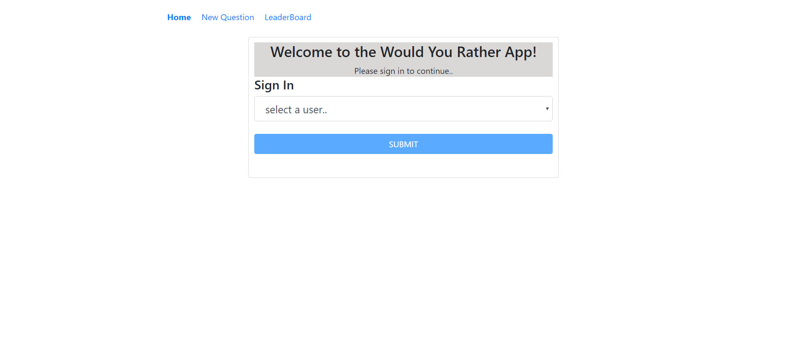
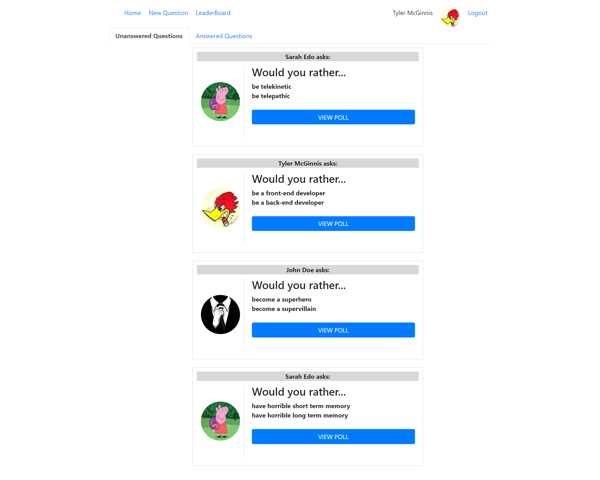
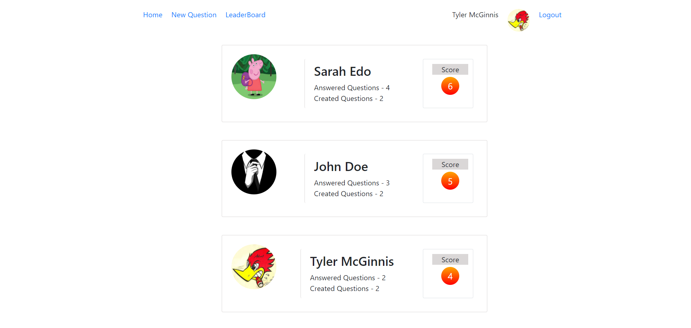
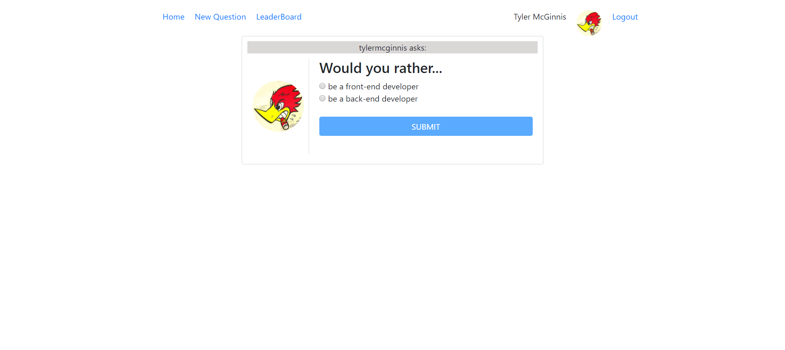
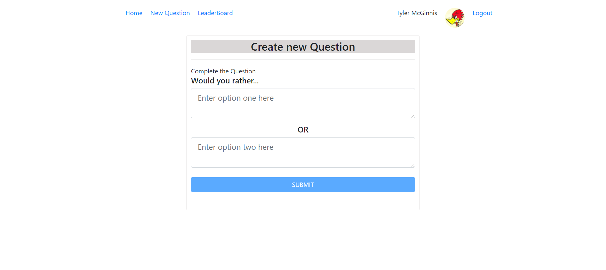

# Would You rather?

A web app that lets a user play the “Would You Rather?” game. The game goes like this: A user is asked a question in the form: “Would you rather [option A] or [option B] ?”. Answering "neither" or "both" is against the rules.

A users will be able to answer questions, see which questions they haven’t answered, see how other people have voted, post questions, and see the ranking of users on the leaderboard.

## Login Page View


## Home Page View


## Leader Board Page View


## Answer Poll Page View


## Create New Page View


## TL;DR

To get started developing right away:

* install all project dependencies with `npm install`
* start the development server with `npm start`


## What You're Getting
```bash
├── README.md - This file.
├── package.json # npm package manager file. It's unlikely that you'll need to modify this.
├── public
│   ├── favicon.ico # React Icon, You may change if you wish.
│   └── index.html # DO NOT MODIFY
└── src
    ├── Actions
    │   ├── ErrorMsg.js # Action creators for ErrorMsg state of the store.
    │   ├── LoggedInUser.js # Action creators for authedUser state of the store.
    │   ├── Questions.js # Action creators for Questions state of the store.
    │   ├── Shared.js # Action creators for Questios and Users state of the store.
    │   ├── Types.js # Declare action types as constants to access globally.
    │   ├── Users.js # Action creators for users state of the store.
    ├── Components
    │   ├── Answered.js # component to view all answered question by the authenticated user.
    │   ├── AnswerPOll.js # component to submit answer to a question by authenticated user
    │   ├── App.js # This is the root of the app, Application route's are configured here
    │   ├── ErrorPage.js # component to view any errors in the application.
    │   ├── Header.js # component holds navigation, login and logout
    │   ├── Home.js # component that combines answered and unanswered components in tabs.
    │   ├── LeaderBoard.js # component to rank application users.
    │   ├── Login.js # component for user to login.
    │   ├── Logout.js # component to logout.
    │   ├── NewPollQuestion.js # component to create new question.
    │   ├── Poll.js # component decides if the user has already answered the question and shows poll result or answer poll page  
    │   ├── PollResult.js # componenet to show poll results
    │   ├── PrivateRoute.js # component to redirect user if not logged in
    │   ├── UnAnswered.js # component to view all unanswered question by the authenticated user.
    │   ├── UsersProfile.js # component to user statistics
    │   ├── viewPollQuestion.js # component to show one question per instance
    ├── Middleware
    │   ├── index.js # root middleware
    │   └── logger.js # middleware to log user action
    ├── Reducers
    │   ├── ErrorMsg.js # reducer for ErrorMsg state of the store.
    │   └── index.js # root reducer
    │   ├── LoggedInUser.js # reducer for authedUser state of the store.
    │   ├── Questions.js # reducer for Questions state of the store.
    │   ├── Users.js # reducer for users state of the store.
    ├── static
    │   ├── images # images folder.
    │   │   ├── 1.jpg 
    │   │   └── 2.jpg 
    │   │   ├── 3.jpg
    ├── Utils
    │   ├── _DATA.js # mock api
    │   ├── api.js # api to access data
    │   ├── Helper.js # general functions
    ├── App.css # Styles for your app. Feel free to customize this as you desire.
    ├── App.test.js # Used for testing. Provided with Create React App. Testing is encouraged, but not required.
    ├── index.css # Global styles. You probably won't need to change anything here.
    └── index.js # You should not need to modify this file. It is used for DOM rendering only.
```
